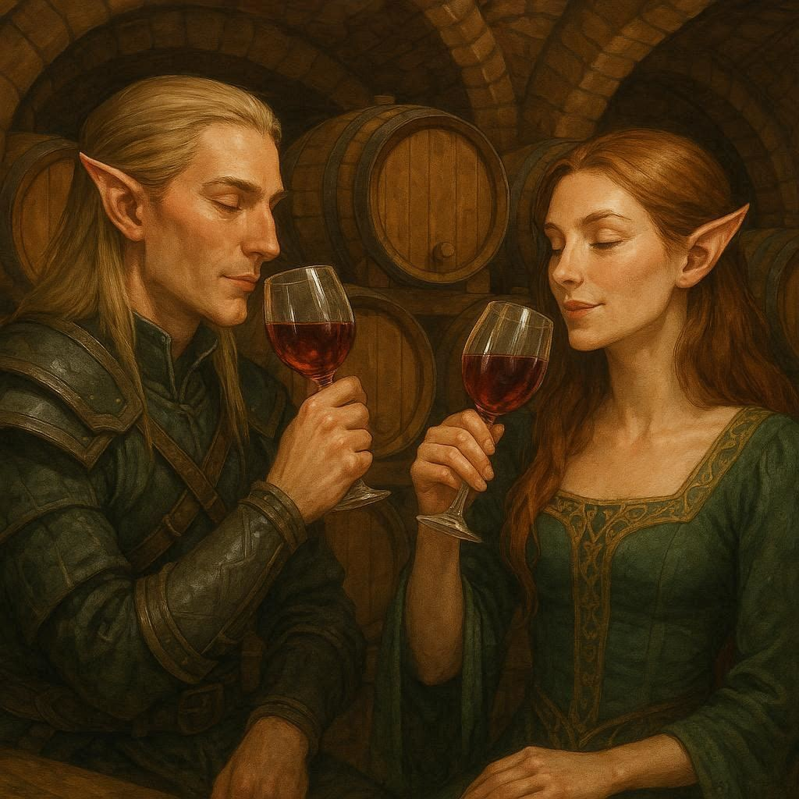

# WineDB

Database and application for managing and analyzing wine consumption.



###### Image created by Bing Image Creator (Dall-E)

---

# How to Use

## Installation

Using the `pyproject.toml` file, use `pip` to install:

```sh
pip install .
```

To use the dev tools, install with the optional `[dev]` dependency:

```sh
pip install .[dev]
```

## Settings File

This application requires an automatic syncing service, typically OneDrive or Google Drive. For me, I use Google Drive.

For this to work, you'll need to install a syncing agent if not already present. (OneDrive typically comes with Microsoft Office, but Google Drive needs separate software to sync.) **[Google Drive Sync](https://ipv4.google.com/intl/en_zm/drive/download/)**

Once this is installed, open the `settings_example.json` file and **SAVE-AS** `settings.json`. This is gitignored, so it won't be added to the repo. In `settings.json`, add the relative path to the location of intended spreadsheet file. Example:

```json
{
    "sync_path": "../../MyDrive/My Stuff/Misc/JN_WineDB.xlsx"
}
```

## Running the App

Once settings file is configured and the software is installed, start the application by running:

```sh
python main.py
```

From there, follow the prompts to add, consume, or move wine bottles in your supply.

---

# Software Leveraged

- [FastAPI](https://fastapi.tiangolo.com/)
- [SQL Models](https://sqlmodel.tiangolo.com/)
- [SQLite3](https://docs.python.org/3/library/sqlite3.html)
- [Pandas](https://pandas.pydata.org/)
- [Numpy](https://numpy.org/)
